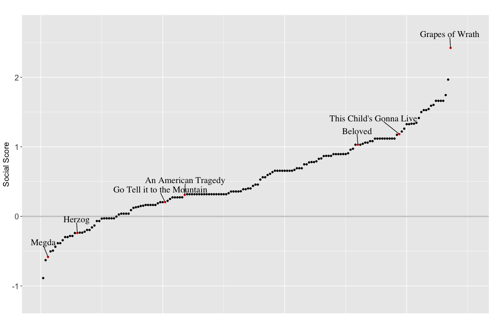

```{r setup, echo = FALSE, include = FALSE, warning = FALSE, message = FALSE}
knitr::opts_chunk$set(echo = FALSE, warning = FALSE, message = FALSE)
knitr::write_bib(c("racial"), "citation.bib", width = 60)

# load necessary packages 

library(tidyverse)
library(janitor)
library(rstanarm)
library(ggrepel)
library(dplyr)
library(infer)
library(gt)
library(broom)
library(formattable)
library(expss)
library(lme4)
library(stargazer)
library(ggridges)

```

## Abstract

@racial determine that novelists marked as “white” versus “black” produce different narratological effects with respect to the interaction of race and religious authority, finding that black writers who cite the Bible are more likely to cite it in a social context compared to white writers who cite the Bible in their novels. I was able to successfully replicate the results of the authors' paper. For my extension, I decided to reconstruct the paper's primary model using a Bayesian approach. I found that the results of the model were largely the same the as that of the original, proving that the original results are even more robust than the authors initially claimed. This corroborates and strengthens the author's conclusions about how race and writing intersect across more than a century of U.S. fiction.

## Introduction

In their project, @racial sought to test their hypothesis about novelists of different races producing different narratological effects in their works with respect to the Bible. To select their sample of novels, @racial drew from a larger corpus constructed from a list of the most frequently held novels by American authors published between 1880 and 2000 as catalogued by WorldCat. They narrowed down the original 6,000 authors represented in the corpus to only those novels written by authors with marked racial identities, labeling the authors only if they identified in one particular way or if their identity was documented in the scholarly record. @racial then selected novels written by authors who identified as “black” or "African-American" to represent their “corpus of novels by black authors" and created a parallel corpus of “white” writers, which far outnumber black writers in the larger corpus, by selecting works that similarly skewed canonical. @racial then use a sequence alignment method to identify quotations of repetitions of specific lines and phrases to determine textual commonality between texts. Throughout this process, the authors acknowledge several biases in their methods. In selecting the corpus, they omit African-American novels which are not traditionally marked as "novelistic" to maintain the corpus's canonical skew because otherwise their comparison of “white” and “black” writers would be an anarchic comparison of distinguished black writers against a sea of high and low white writers of all genres. @racial also recognize that their crude, provisional identification of authors' racial identities is complicated by the particular exigencies of shifting social and historical circumstance and may have not have any implication on novels written under the sign of such identities. The authors ultimately constructed a mixed model that explains whether or not a text is "social" as a function of the author's gender, race, whether or not they cited the Bible as a control variable, and the interaction of the race and bible variables, also accounting for the random effect of a single novel. Their results conclude black writers who cite the Bible are more likely to cite it in a social context compared to white writers who cite the Bible in their novels.

I was able to replicate all results found by @racial. The authors generously made their data available alongside their paper at Harvard Dataverse.^[@data] I used R to complete my replication.^[@R] My replication paper is publically accessible in my Github repository.^[[Github repository](https://github.com/amanda-y-su/race-writing-computation).]

For my extension, I decided to reconstruct the paper's primary model using a Bayesian approach. While the authors used the glmer function to fit a generalized mixed-effects model, I instead use stan_glmer to fit a Bayesian generalized linear mixed effects model with group-specific terms from the rstanarm package.^[@rstanarm] The Bayesian model adds priors on the regression coefficients and priors on the terms of a decomposition of the covariance matrices of the group-specific parameters. I found that the results of my model were largely the same the as that of the original, proving that the original results are even more robust than @racial initially claimed. This corroborates and strengthens their conclusions about how race and writing intersect across more than a century of U.S. fiction.


## Literature Review and Paper Review

@racial bridge two scholarly fields historically seen as incompatible: cultural analytics (also known as “computational criticism”) and critical race studies. Cultural analytics is an emerging field wherein humanist scholars leverage the increasing availability of large digital materials and the affordances of new computational tools, allowing them to survey semantic and narratological patterns in the English-language novel at the scale of centuries and across tens-of-thousands of texts. Cultural analytics scholars have explored an expanding array of topics, including genre and cultural prestige, but the topic of race and racial difference has remained relatively understudied. While recent scholarship on the relationship between computation and race has been critique-oriented, pointing to computation’s role in intensifying racial stratification and reinforcing existing patterns of social inequality,^[@weapons and @algorithms] @racial seek to determine both computation's affordances and its inadequacies in the study of race and literature. They specifically research whether computational methods can reveal if and how racial difference is expressed in literature — if authors of different racial identifications consistently use different patterns of language, style, and narrative, and if so, what are these patterns? Do they remain stable or change over time?

Generations of traditional literary and religious studies scholars have pointed to the Bible as the basis for the Western cultural imaginary. Traditional scholars of literature and the Bible have long argued that even as the world of the novel has increasingly secularized, its commitment to religious ideas and language has persisted. Canonical literary scholar Northrop Frye conceived the idea of The Great Code to declare the Bible’s universal commonality and significance.^[@bible] A more modern inflection of this trope — “virality” — additionally explains the allure of the language of the Bible.^[@romantic] Indeed, the Bible possesses a distinct “resonance” that attracts both white and black writers.

@racial seek to unsettle the narrative of the Great Code by excavating differences in how black and white novelists quote the Bible in their works. Their early attempts, however, were unfruitful. First, they assessed whether one group cited the Bible more frequently than the other by randomizing the race labels in their dataset and pulling from them a null distribution of quotation counts. They found that the actual amount of Bible quotation by each group was not significantly different from this null distribution. That is, had we assigned the race labels randomly, we could have expected the same rates of quotation. They then tested whether or not white and black writers cite the Bible at different rates over time, finding that black writers did not explicitly cite the Bible more or less than white writers at any point in time. The authors then examined if novelists were citing different parts of the Bible, noting differences between the ideological orientation of the Old and New Testaments. However, after they analyzed whether chapters from either were being cited at different rates, the results were inconclusive. Then, they looked to the words surrounding the aligned Bible passages but could not conclude that white and black writers, as a whole, used a different vocabulary when invoking the Bible or discussed different topics. 

@racial then readjusted their approach by examining whether writers differed in how they cited the bible by looking for moments of sociality, defined as the presence of two or more characters engaged in a dialogue or interaction. While not denying the centrality of the Bible in black communities and its frequency of citation among black writers, black studies scholars argue black writers' inovcation of the Bible usually occurs through a process of “critical modification and revision^[@idiom]. This process takes several forms: irony, criticism, and dialogism. The latter refers to the Bible's mention inciting debate or dialogue by a cohort of characters, including potentially the narrator, rather than occuring as a monologic polemic or sermon. Scholars argue that the Bible's appearance and quotation in novels by black authors tend to be very dialogic and interactive all in an effort to question the Bible’s normative or hegemonic “white” meaning. This understanding ultimately informed the creation of the authors' final model explaining the sociality of a text as a function of the novelist's race. 

## Replication

To test their theory about novelists of different races producing different narratological effects in their works with respect to the Bible, @racial constructed a model that explains whether or not a text is "social" as a function of the author's gender, race, whether or not they cited the Bible as a control variable, the interaction of the race and bible variables, and the random effect for each novel. 

I was able to successfully replicate every aspect of the paper.

## Extension

```{r mixed-model, message = FALSE, results='asis'}

# read in data from tagged contexts

model_data <- read.csv("original-paper/raw-data/./TAGGED_CONTEXTS.csv")[,-1]

# create a model that explains social as a function of race, bible, the interaction of race and bible
# and the random effect of title (novel)
# I use the function stan_glmer to create a mixed effects model

fit_robust_mixed <- stan_glmer(social ~ gender + race + bible + race:bible + (1|title), data = model_data, family = binomial, refresh = 0)

# display the terms of the model in a table

x2 <- tidy(fit_robust_mixed) %>%
  rename(Statistic = term,
         Mean = estimate,
         "St. Dev." = std.error)

knitr::kable(x2)

```

**Table 1:** Mixed Model Explaining the Fixed Effects of Author Gender, Race, Bible Citation, Race and Bible's Interaction on the Sociality of a Text and the Random Effect of Single Novels

I fit a mixed effects model explaining the fixed effects of an author's gender, race, their citation of the Bible, the interaction between race and Bible, and the random effects of single novels on the sociality of a text. I create a mixed model with "title" added as a random effects variable as @racial did to ensure that no single novel might be contributing a disproportionate amount of Bible quotations and become the source of any specific effect. The “Bible” variable indicates whether the
Bible is cited or not.Whereas @racial decided to perform a maximum likelihood estimation of generalized linear models to determine the predicted values of model coefficients, I perform a full Bayesian estimation to find the average expected values for coefficients. Expected value averages are preferrable to  predicted values because the latter contains both fundamental and estimation uncertainty, whereas the former only has to account for the estimation uncertainty caused by not having an infinite number of observations.^[@statistical} As a result, predicted values have a larger variance than expected values. I ultimately found that the primary results of the original paper are largely unchanged even when using a Bayesian approach to create the model. Both models show that an author being male, the author being black, and the author citing the Bible negatively affect the sociality of a text while the main coefficient of interest — the interaction of race and bible or the author both being black and citing the bible while controlling for gender — has a positive effect on sociality. 

&nbsp;
&nbsp;
&nbsp;

```{r fixed-model, results = "asis", message = FALSE}

# create a model that explains social as a function of race, bible, the interaction of race and bible
# I use the function stan_glm 

fit_robust <- stan_glm(social ~ gender + race + bible + race:bible, data=model_data, family=binomial, refresh = 0)

# display the terms of the model in a table

x1 <- tidy(fit_robust) %>%
  rename(Statistic = term,
         Mean = estimate,
         "St. Dev." = std.error)

knitr::kable(x1)

```

**Table 2:** Fixed Model Explaining the Effect of Author Gender, Race, Bible Citation, and Race and Bible's Interaction on the Sociality of a Text

I fit an additional fixed effects model explaining the effects author's gender, race, their citation of the Bible, the interaction between race and Bible on the sociality of a text without the random effects of single novels. Using stan_glm instead of stan_glmer with random effects allows me to construct the resulting posterior distributions using the model and find the predicted likelihoods of a text being marked as "social" given the following conditions: a white female author not citing the Bible, a white female author citing the Bible, a white male author not citing the Bible, a white male author citing the Bible, a black female author not citing the Bible, a black female author citing the Bible, a black male author not citing the Bible, and a black male author citing the Bible.

&nbsp;
&nbsp;
&nbsp;

```{r posterior, results = "asis", message = FALSE}

# I create a tibble of fake data with eight observations for each of the eight conditions: 
# white female, no Bible citation
# white female, Bible citation
# white male, no Bible citation
# white male, Bible citation
# black female, no Bible citation
# black female, Bible citation
# black male, no Bible citation
# black male, no Bible citation

tibble <- tibble(race = c(1, 1, 1, 1, 0, 0, 0, 0), gender = c(0, 0, 1, 1, 0, 0, 1, 1), bible = c(0, 1, 0, 1, 0, 1,0,1))

# find the predicted likelihoods of a text being marked as "social" given the above conditions 
# (race, gender, citation of Bible) using my model and fake data 

linpred <- posterior_linpred(fit_robust, transform = TRUE, newdata = tibble) %>%
  
  # convert matrix to tibble for easier manipulation
  
  as_tibble() %>%
  
  # combine the eight columns for individual texts into one column

  pivot_longer(cols = 1:8) %>%
  
  # mutate the levels under the "name" column so that they are more informative, including information about the 
  # race and gender of the author and whether or not the Bible was cited 
  
  mutate(name = ifelse(name == "1", "Black Female, No Bible", 
                       ifelse(name == "2", "Black Female, Bible", 
                              ifelse(name == "3", "Black Male, No Bible",
                                     ifelse(name == "4", "Black Male, Bible", 
                                            ifelse(name == "5", "White Female, No Bible", 
                                                   ifelse(name == "6", "White Female, Bible",
                                                          ifelse(name == "7", "White Male, No Bible", 
                                                                 "White Male, Bible")))))))) %>%
  
  # transform the column with the predicted probabilities using plogis to obtain the probability for the given 
  # log odds values
  
  mutate(value = plogis(value)) %>%
  
  # create plot with x axis as the predicted likelihoods of a text being assigned "social", y axis as the condition,    # and with the data grouped by condition

  ggplot(aes(x = value, y = name, group = name)) +
  
  # create a density ridges plot showing the distribution of predicted likelihoods across the various conditions

  geom_density_ridges(fill = "light blue") +
  
  # format density ridges plot for easier readability

  theme_ridges() + 
  
  # add titles and labels
  
  labs(x = "Probability", y = "Condition")

# display plot of predicted probabilities 

linpred

```

&nbsp;

**Graph 1:** Distribution of Predicted Likelihoods of a Text Being Social Given An Author's Race, Gender, and Citation of the Bible in Their Work

This ridges plot visualizes the resulting posterior distributions generated from my fixed effects model (Table 2). A comparison between the Black Female, Bible and Black Male, Bible ridges and the White Female, Bible, and White Male, Bible ridges reveals that the predicted likelihood of an invocation of the Bible in a text occurring in a social context is greater when it is a black author citing the Bible than when a white author is citing the Bible, as concluded by both @racial and my own models.

## Conclusion

@racial sought to test their theory about novelists of different races producing different narratological effects in their works with respect to the Bible. They constructed a mixed model that explains whether or not a text is "social" as a function of the author's gender, race, whether or not they cited the Bible as a control variable, and the interaction of the race and bible variables, also accounting for the random effect of a single novel. Their draw their corpus from a list of most frequently held novels by American authors published between 1880 and 2000, paring the sample down to just those novels by authors with known racial identities and selecting only white and black canonical authors as a control mechanism. Their results conclude black writers who cite the Bible are more likely to cite it in a social context compared to white writers who cite the Bible in their novels.

I successfully replicated all results found by @racial. The authors generously made their data available alongside their paper at Harvard Dataverse.^[@data] I used R^[@R] to complete my replication, which is publically accessible in my Github repository.^[[Github repository](https://github.com/amanda-y-su/race-writing-computation).]

I extended on @racial by reconstructing the paper's primary model using a Bayesian approach. I use stan_glmer to fit a Bayesian generalized linear mixed effects model with group-specific terms, adding priors on the regression coefficients and allowing me to update these initial beliefs in the evidence of new data. My model yielded largely the same results as that of the original model, proving that the original results are even more robust than @racial initially claimed and thus strengthening their conclusions about how an author's race interacts with their writing across more than a century of U.S. fiction.

\newpage

## References

<div id="refs"></div>

\newpage

## Appendix {-}

```{r model1, include = FALSE, echo = FALSE, warning = FALSE, message = FALSE}

# read in data from tagged contexts

model_data <- read.csv("original-paper/raw-data/./TAGGED_CONTEXTS.csv")[,-1]

# create a model that explains whether or not a the Bible is contextualized in a social way as a 
# function of the gender of the author, the race of the author, whether or not the Bible was 
# cited, the interaction between the author's gender and the bible variable, the interaction between 
# the race of the author and bible and the random effect of title (the novel)

fit1 <- glmer(social ~ gender + race + bible + gender:bible + race:bible + (1|title), nAGQ=0, data=model_data, family=binomial, refresh = 0)

# print model

print(fit1, digits = 3)

```

```{r model2, echo = FALSE, warning = FALSE, message = FALSE, include = FALSE}

# create a model that explains social as a function of race, bible, the interaction of race and bible
# and the random effect of title (novel)

fit2 <- glmer(social ~ gender + race + bible + race:bible + (1|title), data=model_data, nAGQ=0, family=binomial, refresh = 0)

# print model

print(fit2, digits = 3)

```

```{r graphic, echo = FALSE, include = FALSE, warning = FALSE}

# read in social scores data

social_scores <- read.csv("original-paper/raw-data/SOCIAL_SCORES.csv")

# extract only Bible alignments

social_scores <- social_scores %>% 
  filter(sample_group == "KJV_align")

# set index column

social_scores$idu <- as.numeric(row.names(social_scores))

# The authors derive a coefficient from the regression model that indicates the relative "sociality" of a text. 
# This measure captures how well an individual text conforms to the associations between race, gender, and biblical citation discovered in the overall corpus. For instance, a text by a black writer that frequently quotes the Bible 
# and only in a “social” way will score high on this scale. Conversely, a text by a white writer who quotes the Bible # frequently in a non-social way will score very low. These scores allow us to pivot between individual works and the # background trends evident in the data, but also to relate them to each other in ways that loosen the link between # text and race as a categorical label.

# The following graphic from the original paper plots the social scores for all texts that cite the Bible:

# plot the results in a ggplot where the x axis is the index and the y axis is the social score

plot <- ggplot(data = social_scores, 
            aes(x = idu , y = score, label = labeled_points))

# add a line that delineates the x axis 

plot + geom_hline(yintercept = 0, size = 1.2, color = "gray80") +
  
  # plot points for each of the observations
  
  geom_point(aes(color = highlight), size = 1.2) + 
  
  # add text directly to the plot to label points 
  
  geom_text_repel(size = 3, nudge_y = .2, nudge_x = -.3) +
  
  # set the limits of the axes for readability 
  
  scale_y_continuous(limits = c(-1.2, 2.7)) +
  scale_x_continuous(limits = c(1, 175)) +
  
  # add labels and titles 
  
  labs(x = "", y = "Social Score", 
       title="Social Score for All Novels Containing Alignments with the Bible", 
       caption = "NOTE: Lower scores indicate novels where the Bible is less frequently cited in a 'social' way, as we define the term. \nScores closer to zero indicate novels where the 'social' and 'non-social' contexts are split evenly, as in James Baldwin's \nGo Tell it to the Mountain.\n\n Data obtained from 'Race, Writing, and Computation: Racial Difference and the US Novel' \nby Richard So, Hoyt Long, and Yuancheng Zhu") +
  
  # adjust colors of the different points so they're easier to see
  
  scale_color_manual(labels = c("yes", "no"), values = c("black", "red")) +
  
  # adjust font sizes for readability and aesthetics 
  
  theme(legend.position = "", 
        axis.text.x = element_blank(), 
        axis.ticks.x = element_blank(), 
        axis.text=element_text(size=14), 
        plot.caption = element_text(size = 8))

```

Results from @racial were successfully replicated. All analysis for this paper is available at my Github repository^[[Github repository](https://github.com/amanda-y-su/race-writing-computation).]


