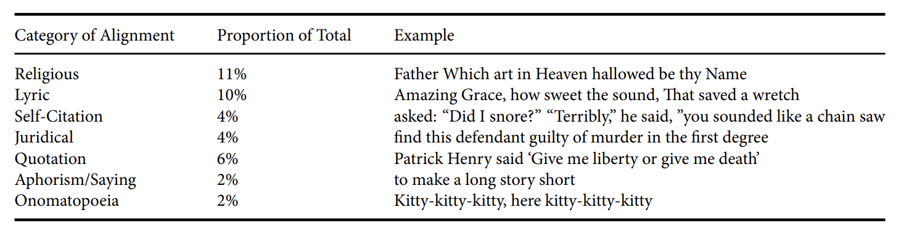

# Intro 
```{r setup, echo = FALSE, include = FALSE}
knitr::opts_chunk$set(echo = FALSE)
knitr::write_bib(c("racial"), "citation.bib", width = 60)

# load necessary packages 

library(tidyverse)
library(janitor)
library(rstanarm)
library(ggrepel)
library(dplyr)
library(infer)
library(gt)
```

This is my pdf document for my milestone 5 for GOV 1006. ^[All analysis for this paper is available at my [Github repository](https://github.com/amanda-y-su/race-writing-computation)]. I make use of @racial, @literary, @afro-american, @essays, and @traces.

# Overview of Replication Paper 

The authors of the paper "Race, Writing, and Computation: Racial Difference and the US Novel, 1880-2000" seek to implement a computational study of race that explores how computation can present new opportunities for thinking about racial difference and its  patterns and regularities at scale. They develop a case study that focuses on race, religion, and the United States novel and build a model that tests if novelists marked as “white” versus “black” produce different narratological effects with respect to the interaction of race and religious authority, in particular, the authority of the Bible. In simpler terms, do writers identified as racially different contextualize the Bible in different ways in their novels? Then, the authors identify a set of general patterns in these effects that they interpret through the model’s reliance on concrete categories of racial identity. The ultimate aim of this is to propose a method for deforming this very categorical thinking. The authors' logistic regression model reveals the relationship of race, gender, and biblical citation to the “sociality” of contexts where the Bible is quoted. That is, they model the relationship between the “Bible” and “race” variables to determine what are the odds of a Bible context being “social” increases or decreases based on the race variable, the options being "white" or "black." For the purposes of this paper, moments of sociality, are defined as the presence of two or more characters engaged in dialogue or interaction. The question at hand is how a writer's identity as "white" or "black" significantly changes the likelihood that the scene of their citation of the Bible in their work is “social”. The study ultimately finds that when a white writer quotes the Bible, it is less likely that she/he quotes it in a social context compared to when she/he writes about non-Bible related topics. However, when a black writer quotes the Bible, it is more likely that she/he quotes it in a social context.

# Graphic

```{r graphic, echo = FALSE, include = TRUE, warning = FALSE}

# read in social scores data

social_scores <- read.csv("SOCIAL_SCORES.csv")

# extract only Bible alignments

social_scores <- social_scores %>% 
  filter(sample_group == "KJV_align")

# set index column

social_scores$idu <- as.numeric(row.names(social_scores))

# plot the results in a ggplot where the x axis is the index and the y axis is the social score

plot <- ggplot(data = social_scores, 
            aes(x = idu , y = score, label = labeled_points))

# add a line that delineates the x axis 

plot + geom_hline(yintercept = 0, size = 1.2, color = "gray80") +
  
  # plot points for each of the observations
  
  geom_point(aes(color = highlight), size = 1.2) + 
  
  # add text directly to the plot to label points 
  
  geom_text_repel(size = 3, nudge_y = .2, nudge_x = -.3) +
  
  # set the limits of the axes for readability 
  
  scale_y_continuous(limits = c(-1.2, 2.7)) +
  scale_x_continuous(limits = c(1, 175)) +
  
  # add labels and titles 
  
  labs(x = "", y = "Social Score", 
       title="Social Score for All Novels Containing Alignments with the Bible", 
       caption = "NOTE: Lower scores indicate novels where the Bible is less frequently cited in a 'social' way, as we define the term. \nScores closer to zero indicate novels where the 'social' and 'non-social' contexts are split evenly, as in James Baldwin's \nGo Tell it to the Mountain.\n\n Data obtained from 'Race, Writing, and Computation: Racial Difference and the US Novel' \nby Richard So, Hoyt Long, and Yuancheng Zhu") +
  
  # adjust colors of the different points so they're easier to see
  
  scale_color_manual(labels = c("yes", "no"), values = c("black", "red")) +
  
  # adjust font sizes for readability and aesthetics 
  
  theme(legend.position = "", 
        axis.text.x = element_blank(), 
        axis.ticks.x = element_blank(), 
        axis.text=element_text(size=14), 
        plot.caption = element_text(size = 8))

```


# Appendix

```{r table, echo = FALSE}

# read in the alignments data

alignments <- read.csv("ALL_ALIGNMENTS.CSV") %>%
  
  # clean names so they're easier to type and work with 
  
  clean_names %>%
  
  # group by label and examples of sources so that I count how many unique observations there are 
  
  group_by(label, sourcematchcontext) %>%
  
  # use summarize to count the number of unique observations
  
  summarize(n = n()) %>%
  
  # group by label again to sum the total number of observations per category
  
  group_by(label) %>%
  
  # count the number of observations per category and assign to sum 
  
  mutate(sum = sum(n)) %>%
  
  # ungroup data to divide this sum by the total number of observations to get the proportion
  
  ungroup() %>%
  mutate(prop = sum/n()) %>%
  
  # group by label again to randomly pick one observation for the example per category 
  
  group_by(label) %>%
  sample_n(1) %>%
  
  # ungroup by label 
  
  ungroup(label) %>%
  
  # filter for only the categories present in the table 
  
  filter(label == "Religion" | label == "Lyric" | label ==  "Law" | label == "Quote" | label ==  "Aphorism" | label == "Onom" | label == "SelfCite") %>%
  
  # rename label as categories 
  
  mutate(categories = label) %>%
  
  # select for only the variables of interest: categories, sourcematchcontext, proportion
  
  select(categories, sourcematchcontext, prop)
  
# rename the levels in categories so they match the ones in the paper
levels(alignments$categories) <- list("Aphorism/Saying" = "Aphorism", "Religious" = "Religion", 
                                      "Lyric" = "Lyric", "Self-Citation" = "SelfCite", 
                                      "Juridical" = "Law", "Quotation" = "Quote", 
                                      "Onomatopoeia" = "Onom")

# create a gt table using the alignments data

table <- alignments %>%
  gt() %>%
  
  # add a header
  
  tab_header(
    title = "Most Common Categories of Alignments After Bible",
  ) %>%
  
  # format the proportion column so it's in percent format 
  
    fmt_percent(columns = vars(prop), decimals = 0) %>%
  
  # adjust the width and font size of the text in the table for readability 
  
   tab_options(
    table.width = 100,
    table.font.size = 15,
    heading.title.font.size = 20,
    heading.subtitle.font.size = 14,
    column_labels.font.size = 17
  ) %>%
  
  # label the different columns
  
  cols_label(categories = "Categories", 
             sourcematchcontext = "Examples", 
             prop = "Proportion of Total") %>%
  
  # left align the columns
  cols_align("left") %>%
  
  # move the examples column to the end as the table in the paper does 
  
  cols_move_to_end(
    columns = vars(sourcematchcontext)
  )

# display the table 
# two things I couldn't figure out are how to display the table on the pdf such that it isn't cut off
# and why the screenshot of the table from the paper displays in the middle of the bibiliography

table

```


# References
