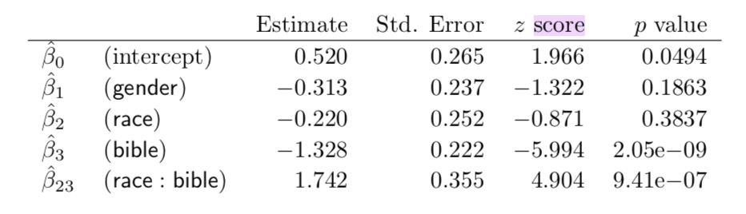

# Intro 
```{r setup, echo = FALSE, include = FALSE, warning = FALSE, message = FALSE}
knitr::opts_chunk$set(echo = FALSE, warning = FALSE, message = FALSE)
knitr::write_bib(c("racial"), "citation.bib", width = 60)

# load necessary packages 

library(tidyverse)
library(janitor)
library(rstanarm)
library(ggrepel)
library(dplyr)
library(infer)
library(gt)
library(broom)
library(formattable)
library(expss)
library(lme4)

```

This is my pdf document for my milestone 5 for GOV 1006. ^[All analysis for this paper is available at my [Github repository](https://github.com/amanda-y-su/race-writing-computation)]. I make use of @racial, @literary, @afro-american, @essays, and @traces.

# Overview of Replication Paper 

The authors of the paper "Race, Writing, and Computation: Racial Difference and the US Novel, 1880-2000" seek to implement a computational study of race that explores how computation can present new opportunities for thinking about racial difference and its  patterns and regularities at scale. They develop a case study that focuses on race, religion, and the United States novel and build a model that tests if novelists marked as “white” versus “black” produce different narratological effects with respect to the interaction of race and religious authority, in particular, the authority of the Bible. In simpler terms, do writers identified as racially different contextualize the Bible in different ways in their novels? Then, the authors identify a set of general patterns in these effects that they interpret through the model’s reliance on concrete categories of racial identity. The ultimate aim of this is to propose a method for deforming this very categorical thinking. The authors' logistic regression model reveals the relationship of race, gender, and biblical citation to the “sociality” of contexts where the Bible is quoted. That is, they model the relationship between the “Bible” and “race” variables to determine what are the odds of a Bible context being “social” increases or decreases based on the race variable, the options being "white" or "black." For the purposes of this paper, moments of sociality, are defined as the presence of two or more characters engaged in dialogue or interaction. The question at hand is how a writer's identity as "white" or "black" significantly changes the likelihood that the scene of their citation of the Bible in their work is “social”. The study ultimately finds that when a white writer quotes the Bible, it is less likely that she/he quotes it in a social context compared to when she/he writes about non-Bible related topics. However, when a black writer quotes the Bible, it is more likely that she/he quotes it in a social context. 

# Graphic

```{r graphic, echo = FALSE, include = TRUE, warning = FALSE}

# read in social scores data

social_scores <- read.csv("SOCIAL_SCORES.csv")

# extract only Bible alignments

social_scores <- social_scores %>% 
  filter(sample_group == "KJV_align")

# set index column

social_scores$idu <- as.numeric(row.names(social_scores))

# plot the results in a ggplot where the x axis is the index and the y axis is the social score

plot <- ggplot(data = social_scores, 
            aes(x = idu , y = score, label = labeled_points))

# add a line that delineates the x axis 

plot + geom_hline(yintercept = 0, size = 1.2, color = "gray80") +
  
  # plot points for each of the observations
  
  geom_point(aes(color = highlight), size = 1.2) + 
  
  # add text directly to the plot to label points 
  
  geom_text_repel(size = 3, nudge_y = .2, nudge_x = -.3) +
  
  # set the limits of the axes for readability 
  
  scale_y_continuous(limits = c(-1.2, 2.7)) +
  scale_x_continuous(limits = c(1, 175)) +
  
  # add labels and titles 
  
  labs(x = "", y = "Social Score", 
       title="Social Score for All Novels Containing Alignments with the Bible", 
       caption = "NOTE: Lower scores indicate novels where the Bible is less frequently cited in a 'social' way, as we define the term. \nScores closer to zero indicate novels where the 'social' and 'non-social' contexts are split evenly, as in James Baldwin's \nGo Tell it to the Mountain.\n\n Data obtained from 'Race, Writing, and Computation: Racial Difference and the US Novel' \nby Richard So, Hoyt Long, and Yuancheng Zhu") +
  
  # adjust colors of the different points so they're easier to see
  
  scale_color_manual(labels = c("yes", "no"), values = c("black", "red")) +
  
  # adjust font sizes for readability and aesthetics 
  
  theme(legend.position = "", 
        axis.text.x = element_blank(), 
        axis.ticks.x = element_blank(), 
        axis.text=element_text(size=14), 
        plot.caption = element_text(size = 8))

```


# Appendix

**Table 1: Summary**

```{r summary-table, echo = FALSE, message = FALSE, warning = FALSE}

# read in the alignments data

alignments <- read.csv("ALL_ALIGNMENTS.CSV") %>%
  
  # clean names so they're easier to type and work with 
  
  clean_names %>%
  
  # group by label and examples of sources so that I count how many unique observations there are 
  
  group_by(label, sourcematchcontext) %>%
  
  # use summarize to count the number of unique observations
  
  summarize(n = n()) %>%
  
  # group by label again to sum the total number of observations per category
  
  group_by(label) %>%
  
  # count the number of observations per category and assign to sum 
  
  mutate(sum = sum(n)) %>%
  
  # ungroup data to divide this sum by the total number of observations to get the proportion
  
  ungroup() %>%
  mutate(prop = sum/n()) %>%
  
  # group by label again to randomly pick one observation for the example per category 
  
  group_by(label) %>%
  sample_n(1) %>%
  
  # ungroup by label 
  
  ungroup(label) %>%
  
  # filter for only the categories present in the table 
  
  filter(label == "Religion" | label == "Lyric" | label ==  "Law" | label == "Quote" | label ==  "Aphorism" | label == "Onom" | label == "SelfCite") %>%
  
  # rename label as categories 
  
  mutate(categories = label) %>%
  
  # select for only the variables of interest: categories, sourcematchcontext, proportion
  
  select(categories, sourcematchcontext, prop)
  
# rename the levels in categories so they match the ones in the paper
levels(alignments$categories) <- list("Aphorism/Saying" = "Aphorism", "Religious" = "Religion", 
                                      "Lyric" = "Lyric", "Self-Citation" = "SelfCite", 
                                      "Juridical" = "Law", "Quotation" = "Quote", 
                                      "Onomatopoeia" = "Onom")

# display the summary table 

formattable(alignments)

```

**Table 2: Model 1**

```{r model-tables, echo = FALSE, warning = FALSE, message = FALSE}

# read in data from tagged contexts

model_data <- read.csv("./TAGGED_CONTEXTS.csv")[,-1]

# create a model that explains whether or not a the Bible is contextualized in a social way as a 
# function of the gender of the author, the race of the author, whether or not the Bible was 
# cited, the interaction between the author's gender and the bible variable, the interaction between 
# the race of the author and bible and the random effect of title (the novel)

# I used stan_glmer as opposed to stan_glm because I am creating a mixed model with a random effect

fit1 <- stan_glmer(social ~ gender + race + bible + gender:bible + race:bible + (1|title), data=model_data, family=binomial, refresh = 0)

# turn model into a tidy tibble

table_1 <- tidy(fit1) %>%
  
  # filter for the terms in the model 
  
  filter(term %in% c("(Intercept)", "gender", "race", "bible", "gender:bible", "race:bible")) %>%
  
  # round values in the model to three decimal places
  
  mutate_if(is.numeric, funs(round(., 3))) 

# display the table 

formattable(table_1)

```

**Table 3: Model 2**

```{r model-tables2, echo = FALSE, warning = FALSE, message = FALSE}

# create a model that explains social as a function of race, bible, the interaction of race and bible
# and the random effect of title (novel)

fit2 <- glmer(social ~ gender + race + bible + race:bible + (1|title), data=model_data, nAGQ=0, family=binomial, refresh = 0)

# turn model into a tidy tibble

table_2 <- tidy(fit2) %>%
  
  # filter for the terms in the model 
  
  filter(term %in% c("(Intercept)", "gender", "race", "bible", "race:bible")) %>%
  
  # round 
  mutate_if(is.numeric, funs(round(., 3))) %>%
  
  # unselect the group column since it isn't relevant to the table 
  # all it displays is the fact that the coefficients represent the fixed effects of variables and that 
  # novel is a random effect 
  
  select(-group)

# display the table

formattable(table_2)

```


**Table 4: Predicted Probabilities**

```{r predicted, echo = FALSE, warning = FALSE, message = FALSE}

# calculate the social scores of each of the texts using the coefficients from the second model 

score = coef(fit2)$title

# add a score column to the model_data tibble 

model_data$score = numeric(nrow(model_data))
for (title in unique(model_data$title)) {
	model_data$score[model_data$title==title] = score[title,1]
}

# preserve only the unique titles/movels in the tibble 

titles = unique(model_data$title)

# create a new data.unique tibble with factor variables race, gender, bible, and score which will use the 
# numerical values from the original tibble and replace them with categorical levels below

data.unique = data.frame(title=titles,
                         race=factor(rep("white",length(titles)),levels=c("white","black")),
                         gender=factor(rep("female",length(titles)),levels=c("female","male")),
                         bible = factor(rep("yes", length(titles)), levels = c("yes", "no")),
                         score=numeric(length(titles)))

# 
for (i in 1:length(titles)) {
  
  # set the levels for each of the indicator variables: race, gender, and bible 
  
	data.unique$race[i] = ifelse(model_data$race[model_data$title==titles[i]][1]==0,"white","black")
	data.unique$gender[i] = ifelse(model_data$gender[model_data$title==titles[i]][1]==0,"female","male")
	data.unique$bible[i] = ifelse(model_data$bible[model_data$title==titles[i]][1]==0,"yes","no")
	data.unique$score[i] = score[titles[i],1]
}

# calculate the predicted probabilities using the data.unique tibble 

predicted <- data.unique %>%
  
  # keep only the unique observations so there aren't duplicates
  
  distinct() %>%
  
  # unselect the title column since it isn't relevant to the calculations of predicted probabilities 
  
  select(-title) %>%
  
  # group the data by race, gender, and bible so calculate the predicted probabilities for each condition 
  
  group_by(race, gender, bible) %>%
  
  # calculate the proportion of observations in each condition group where the social score is greater than 
  # zero, that is the bible is cited in a social context 
  
  summarize(prop = sum(score > 0)/n(),
            
            # calculate the proportion of observations in each condition group where the social score 
            # is less than zero, that is the bible is not cited in a social context 
            
            prop_not = sum(score < 0)/n()) %>%
  
  # create a column that calculates the odds of each of the conditions being social 
  
  mutate(odds = prop/prop_not) %>%
  
  # round every value to three decimal places 
  
  mutate_if(is.numeric, funs(round(., 3))) 

# display predicted probabilities table 

formattable(predicted)
         
```

While I attempted replicating the tables and figures from the original paper, I realized that many of the results my tables yielded were not the same as the ones generated by the authors. To start, the values in table 1 (summary table) were just slightly off. I wasn't able to identify the reason why, though it could likely be an error in my calculations or approach to replicating the table. Table 2 displays the results of a model that explains whether or not the context in which the bible is referenced in a text is "social" as a function of the race of the author, the author's gender, whether or not the bible is referenced as a control variable, and the interaction between race and bible and the interaction between gender and bible. My results for this table were different from that of the authors' because I decided to use stan_glmer to create the model as opposed to glmer, which is what the authors used. The family of lmer functions are used when you have a mixed model with a random variable, which in this case was the title or novel variable. stan_glmer is similar to glmer but with various possible prior distributions for the coefficients. I chose to use stan_glmer because it perfoms a full Bayesian estimation as opposed to just a maximum likelihood estimation of generalized linear models. Table 3 is a simpler model that answers the key question of interest: how the race of an author affects the context in which they write about the bible in their work. The model explains the social variable as a function of race, gender, bible (as a control), and the interaction between race and bible. For the purposes of verifying the authors' results, I decided to use glmer when replicating this model and found that our results were the same. I then attempted to create a table that displayed the fitted, predicted probabilities of the various conditions based on the model. The results in table 4 of these predictions were not the same as that of the authors. I can't to say their results are incorrect primarily because I struggled in the process of replicating this table and could very well have made a mistake. I'm hoping to seek further guidance and advice from Alice, Jack, or Enxhi to verify my approach to these calculations before I make any conclusions.

**Proposed Extension**

My proposed extension to the original paper would involve looking at how the relationship between an author's race and the way they contextualize the Bible in their work is influenced by the time period during which the novel was published. The data available has observations of different novels by United States authors that range from publication in the late 19th century to the early 21st century. With the number of historical events that occurred in that time period, I believe it is reasonable to think that the decade or century in which authors wrote their works could have influenced the way they contextualized religion and the authority of the Bible in their novel. To examine and test this theory, I would create a regression model that explains the variable social — which represents whether or not the author wrote about the bible in their work in a "social" way — as a function of the race of the author, the gender of the author, whether or not the bible was cited, as a control variable, the time period (decade) during which the author's novel was published, the interaction between the race of the author and the bible variable, the interaction between the gender of the author and the bible, the interaction between the time period and bible variable, and finally the interaction between race, time period, and the bible variable. I would coerce the decade variable to a factor so that I could observe the predicted incremental effects of each additional decade on the social variable. The different coefficients of time period would allow me to see how the the context in the Bible is cited in a text changes from decade to decade. The interaction coefficients between race, time period, and the bible variable would allow me to observe how the effect of race on the way the Bible is contexualized differently in a work in different decades. I would specifically be interested in observing how the effects would become more or less extreme during the Civil Rights movement and the Great Awakenings (religious resurgences) throughout United States history between the 18th and 21st century. The original model created by the authors used observations from all time periods. They ultimately concluded from the results of the model that when a white writer quotes the Bible, it is less likely that she/he quotes it in a social context compared to when she/he writes about non-Bible related topics. And when a black writer quotes the Bible, it is more likely that she/he quotes it in a social context. I would be curious to see if these findings still hold in different decades. 

# References